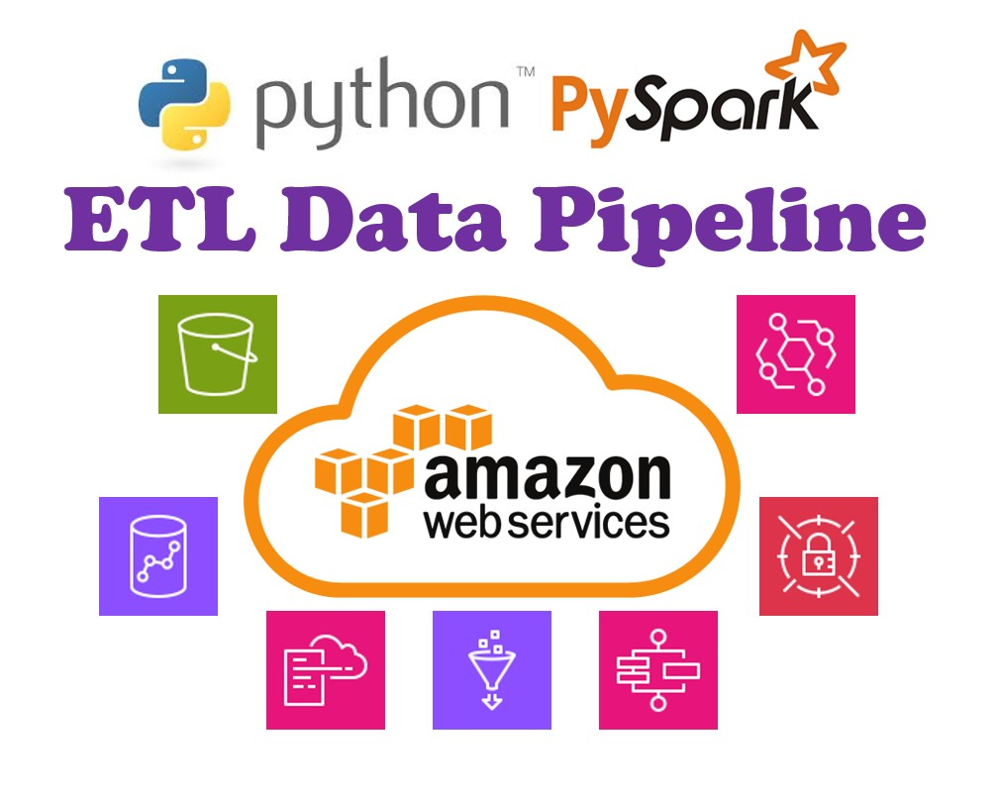
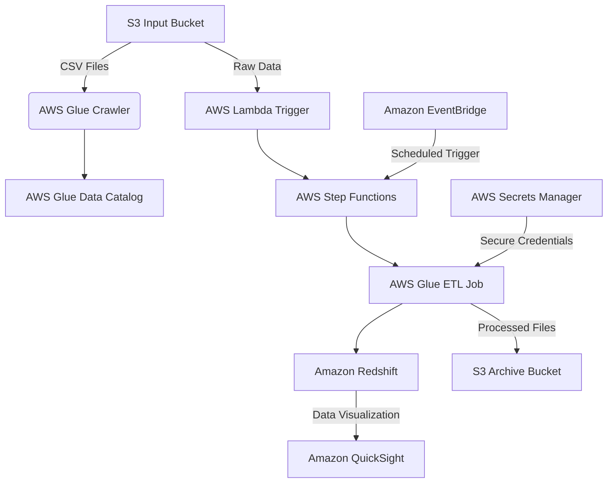
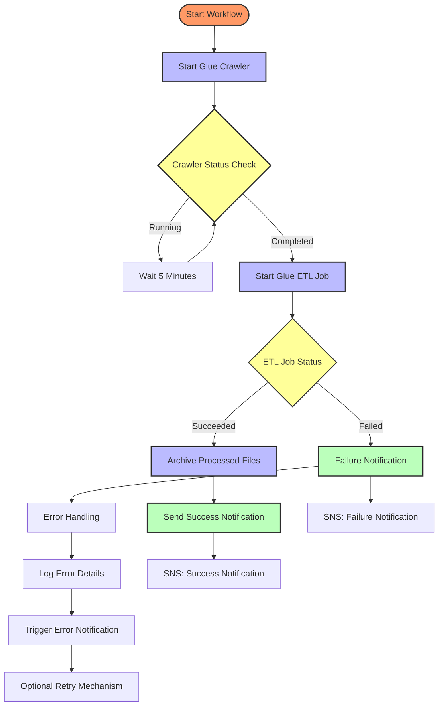

# AWS-Based ETL Data Pipeline
AWS-based data pipeline solution using the most popular and robust services.



As a Data Engineer, using cloud-based services is essential. However, learning all cloud services without a basic understanding of their roles in data engineering solutions may take you a lot of time. So, I suggest you read some sample solutions to create a roadmap and plan for what you should learn and understand their utility in a data project.

This is a very simple ETL Pipeline project implemented on AWS. I tried to demonstrate some of the subjects that should be considered in every **Data Pipeline Solution**.

---
# What you learning
What you should expect to learn and understand after reading this project:
1. How to design a cloud-native data integration workflow using AWS services
2. **Amazon S3** for data storage
3. **AWS Glue** for data crawling and ETL
4. **AWS Step Functions** for workflow orchestration
5. **Amazon Redshift** for data warehousing
6. **Amazon EventBridge** for scheduling
7. **AWS Secrets Manager** for credential management
8. Implementation of **Data Quality** checks during ETL process using **PySpark**
9. **Data Transformation** using **PySpark**
10. Creating complex, fault-tolerant workflows using **Step Functions**
11. Step Functions state machine JSON configuration
12. **CloudFormation** template for **Infrastructure as Code**
13. CloudFormation deployment instructions
14. Understanding **Pricing** for some of different AWS services
15. Strategies for **Cost Optimization**

--- 

# Table of contents
- [The Challenge](#the-challenge)
- [The Solution](#the-solution)
- [The AWS-Based Solution Diagram](#the-aws-based-solution-diagram)
- [Detailed explanation of Solution](#detailed-explanation-of-solution)
- [AWS Glue ETL script](./aws_glue_etl_script.py)
- [Step Functions Workflow Diagram](#step-functions-workflow-diagram)
- [Step Functions Workflow Breakdown](#step-functions-workflow-breakdown)
- [Step Functions Implementation Code](./step_functions_creation.json)
- [Deployment and Configuration Steps](#deployment-and-configuration-steps)
- [AWS CloudFormation template](./CloudFormation_template.yaml)
- [Implementation Guide through CloudFormation](#implementation-guide)
- [Solution Cost Calculation](#cost-calculation-based-on-aws-costs-at-the-time-of-preparing-this-article)
- [Project Cost Control Advises](#some-advises-to-controll-the-project-costs)


## The Challenge
Due to increasing demands for a multi-branch shop, the manager decided to collect all purchase history in one place for further analysis and insights. All purchase data from all branches are exported to CSV files every hour and are accessible to us. We need a solution to make this data ready and move it into a Data Warehouse with online accessibility. 
The CSV files contain the following properties:
[id, shop_id, user_id, product_id, qty, purchase_date, discount]

## The Solution
In response, I designed an AWS-based data pipeline solution to move data from CSV files to a data warehouse. I implemented a scheduled copy command on every sales database server to copy CSV files into a single S3 storage bucket.
The following project is designed to move the CSV files' data into a data warehouse every 12 hours.

During the data ingestion process, the following rules should be considered:
- *product_id* should not contain only numbers; records with incorrect *product_id* should be **deleted**.

In the transformation step, the following changes should be made to the data:
- *purchase_date* should be converted from Unix timestamp to datetime format.
- All *discount* values should be in float format with 2 decimal digits.

At the end, all read CSV files should be moved to Archive.


## The AWS-Based Solution Diagram
To have a Big-Picture of the Solution it is good to see the design result as a diagram. 
Let's take a look at the project 



## Detailed Explanation of Solution
Detailed explanation of this data pipeline architecture:

### 1. Data Ingestion: Amazon S3
- **Input Bucket**: `purchase-data-input-bucket`
  - Store raw CSV files containing purchase data
  - Provides scalable and durable storage
  - Enables easy data collection from various sources

### 2. Data Discovery and Metadata Management: AWS Glue Crawler
- Automatically scans S3 input bucket
- Creates and updates table definitions in AWS Glue Data Catalog
- Detect schema and data types from CSV files
- Enables easy integration with other AWS services

### 3. Orchestration and Workflow: AWS Step Functions
- Coordinates the entire ETL workflow
- Manages complex data transformation logic
- Provides error handling and retry mechanisms
- Triggers AWS Glue ETL jobs
- Implements 12-hour scheduling via Amazon EventBridge

### 4. Data Transformation: AWS Glue ETL Job
- Use PySpark-based ETL jobs
- Implement data transformations:
  - Convert Unix timestamp to datetime
  - Validate product IDs
  - Format discount to float
- Runs in a managed Spark environment
- Scalable and serverless

### 5. Data Loading: Amazon Redshift
- Target data warehouse
- Stores transformed purchase data
- Enables high-performance analytics
- Supports complex queries and reporting

### 6. Security and Credentials: AWS Secrets Manager
- Securely store database credentials
- Rotate credentials automatically
- Integrated with AWS Glue and other services

### 7. Scheduling: Amazon EventBridge
- Trigger Step Functions workflow every 12 hours
- Provides serverless scheduling
- Integrates seamlessly with AWS services

### 8. Data Archiving: S3 Archive Bucket
- Store processed and archived files
- `purchase-data-archive-bucket`
- Implements data retention policies

### 9. Visualization: Amazon QuickSight
- Create interactive dashboards
- Connect directly to Redshift
- Provides business intelligence capabilities


AWS Glue ETL script for above implementation is available in [THIS](./aws_glue_etl_script.py) file

### Step Functions Workflow Diagram



### Step Functions Workflow Breakdown:

1. **Start Glue Crawler**
   - Initiates the Glue Crawler to discover and catalog data
   - Waits for crawler completion
   - Handles potential failures

2. **Start Glue ETL Job**
   - Triggers the ETL job after successful crawling
   - Passes input and output S3 bucket paths
   - Checks job status

3. **Archive Processed Files**
   - Uses Lambda function to move processed files
   - Moves files from input to archive bucket

4. **Notification Handling**
   - Sends success or failure notifications via SNS
   - Provides visibility into pipeline status

The above Step Functions Diagram implementation code is inside [THIS](./step_functions_creation.json) json file 


### Deployment and Configuration Steps:

1. **AWS Glue Setup**:
   - Create a Glue Data Catalog database
   - Set up Glue Crawler to discover S3 data
   - Configure Glue ETL job with the provided script

2. **Step Functions Workflow**:
   - Create a state machine defining:
     - Glue Crawler execution
     - Glue ETL job trigger
     - Error handling
     - Archive file movement

3. **Amazon EventBridge**:
   - Create a rule triggering Step Functions every 12 hours
   - Configure target as Step Functions state machine

4. **Security Configuration**:
   - Create IAM roles with least privilege
   - Store Redshift credentials in Secrets Manager
   - Configure network access and VPC settings


You can find AWS CloudFormation template to automatically create the services in our data pipeline architecture [HERE](./CloudFormation_template.yaml)


### Implementation Guide:

#### Prerequisite Setup:
1. Install AWS CLI
2. Install AWS CloudFormation CLI 
3. Configure AWS credentials with appropriate permissions

#### Deployment Steps:

1. **CloudFormation Deployment**:
   ```bash
   # Validate Template
   aws cloudformation validate-template --template-body file://data_pipeline_cloudformation.yaml

   # Create Stack
   aws cloudformation create-stack \
     --stack-name purchase-data-pipeline \
     --template-body file://data_pipeline_cloudformation.yaml \
     --capabilities CAPABILITY_IAM
   ```

#### Additional Steps:
1. Upload ETL script to S3
2. Configure Redshift connection
3. Set up QuickSight dashboards
4. Configure SNS notifications


### Cost Calculation based on AWS Costs at the time of preparing this article:
- S3 Storage: $0.023 per GB
- Glue ETL: $0.44 per DPU-Hour
- Step Functions: $0.025 per 1000 state transitions
- Redshift: Starts at $0.25 per hour
- EventBridge: $1 per 100,000 events

#### some advises to Controll the project Costs:
- Use Graviton-based instances for cost optimization
- Implement data lifecycle policies


